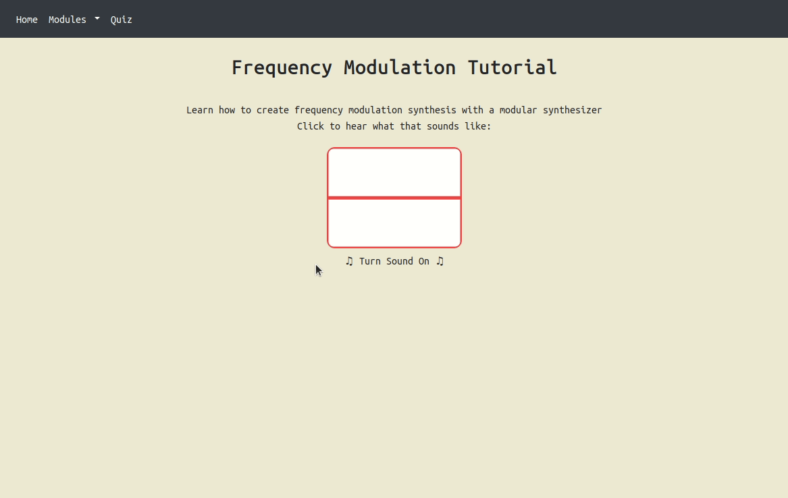
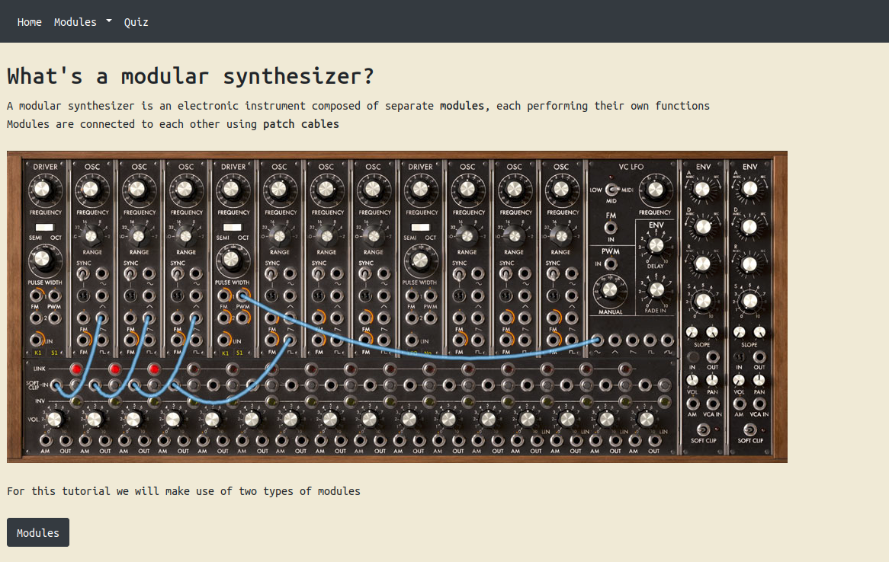
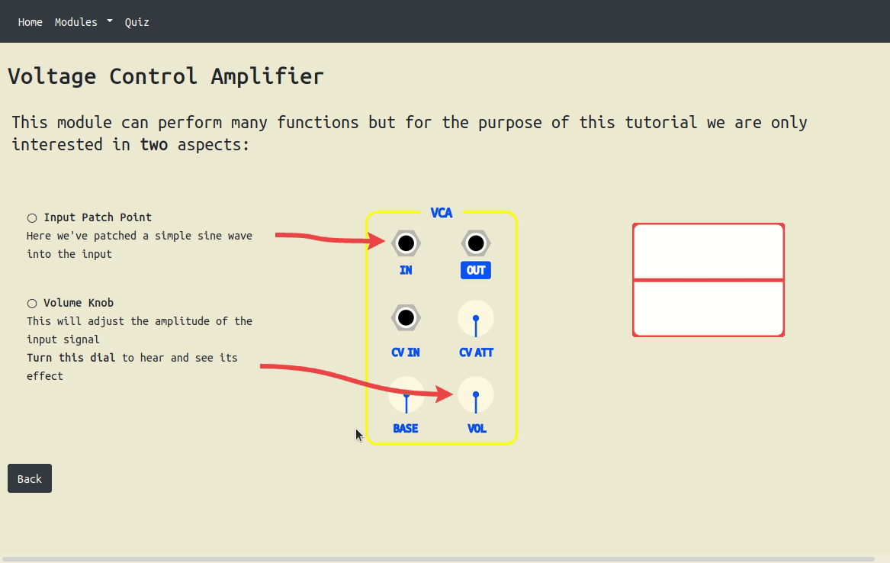
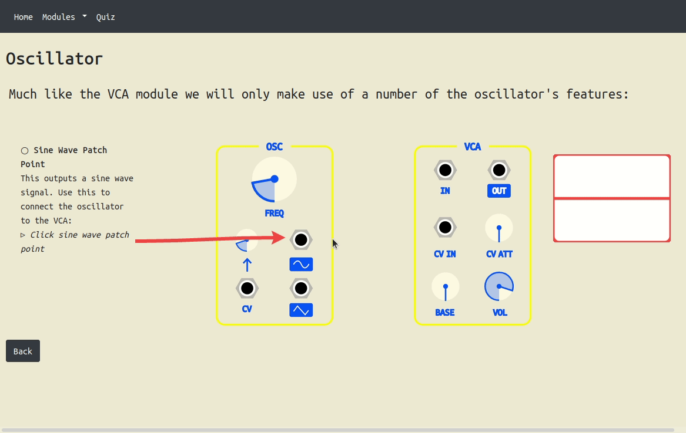
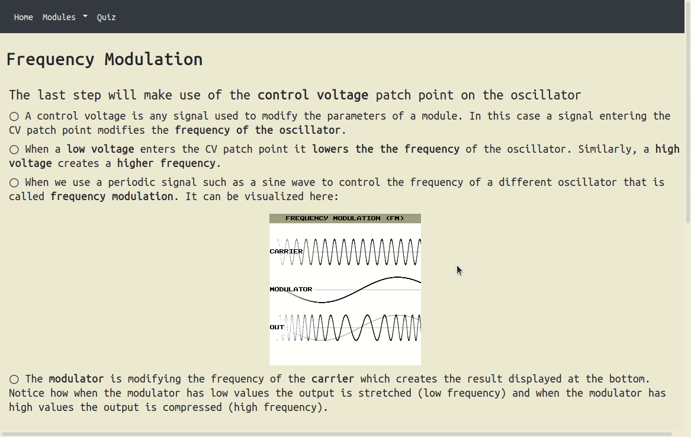
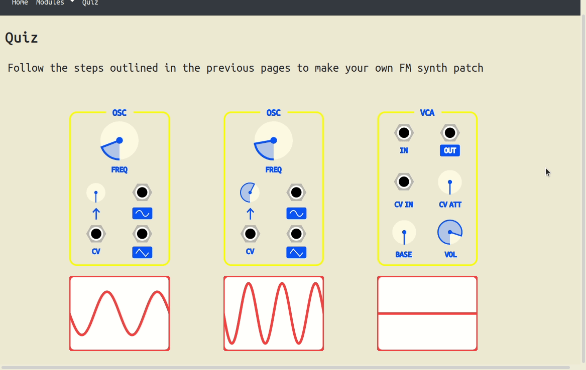

# Modular Synth Tutorial
## Overview
This is an interactive interface designed for teaching the basics of modular synthesis. It is meant to be a tutorial so 
the user can interact with it at their own pace. Each page has audio and visual components the user can interact with. 

## Samples
Below are samples of each page. The tutorial is designed to be completed in the order presented below but there is also 
navigation functionality if the user wants to skip ahead or go back. Obviously there is no sound component in these 
samples so please try on your own computer to get the full experience!

### Home

### Modular Synth Info

### Voltage Control Amplifier

### Oscillator

### Frequency Modulation

### Quiz

